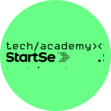

  
   
  <h1>StartSe Tech Academy</h1>

  Acelere os seus primeiros passos na área de tecnologia e conquiste seu espaço na maior oportunidade de carreira de todos os tempos.
  Um Programa Completo de Formação de Desenvolvedores totalmente gratuito.

- Certificado StartSe TechAcademy de Desenvolvedor Júnior
- 100hs de Formação online que te levarão do “ZERO ao Código”
- Mentorias AO VIVO com tira-dúvidas e apoio
- Sessões extras para que você se prepare melhor para o mercado
- Faça parte do Banco de talentos StartSe e seja encontrado pelas melhores empresas.

## 🟢 Qual é o objetivo dessa Formação?

1. Capacitar talentos em estágio inicial de desenvolvimento para atuar em tecnologia. Formar desenvolvedores júnior com as soft skills necessárias, contando com a Jornada para o Futuro da Cia de Talentos.
2. Apoiar os participantes do programa a ocupar posições em tecnologia no mercado de trabalho por meio de certificado.
3. Formar uma rede de profissionais em tecnologia que recebe suporte de carreira, desenvolvimento técnico e de competências e habilidades necessárias para alcance de objetivos profissionais.
4. Conectar os novos talentos de tecnologia com as melhores empresas do mercado.

## 🟢 Jornada para o Futuro: Imersão TECH

  
  

O Jornada para o Futuro é uma iniciativa do Grupo Cia de Talentos que, com o apoio de algumas das maiores empresas do país, oferece diversas atividades e experiências gratuitas que estimulam o desenvolvimento das soft-skills mais valorizadas pelo mercado de trabalho e preparam os participantes para fazerem escolhas profissionais mais conscientes.

Sabemos que o mercado de tecnologia nunca esteve tão aquecido. Neste cenário, ter conhecimento técnico é o esperado, mas potencializar habilidades socioemocionais é o que pode diferenciar os profissionais. Por isso, a Imersão Tech tem o objetivo de desenvolver as pessoas da área da tecnologia nestas competências e prepará-las para os novos desafios que vem surgindo.

<a href="https://www.startse.com/techacademy/clkn/https/jornadaparaofuturo.com.br/">Clique aqui</a> e fique por dentro.

## 🟢 Essa formação é para mim?

- 📗 A partir de 18 anos com Ensino Médio Completo.
- 📗 Conhecimento básico ou incipiente em tecnologia e desenvolvimento.
- 📗 Disponibilidade para participar do programa de 12 semanas, com aulas gravadas e encontros ao vivo.
- 📗 Acesso à internet e computador com microfone e câmera.
- 📗 Interesse genuíno de atuar no mercado de tecnologia.
- 📗 Que ainda não esteja atuando ou empregado na área de tecnologia, mas tenha como objetivo atuar nesse mercado.

## 🟢 Como será sua jornada?

### Antes de começar

1. Validação da sua participação
   1. Após efetuar sua inscrição gratuita você receberá um e-mail para completar o seu processo de cadastro e realizar um teste de nivelamento que garante que está apto a acompanhar o ritmo do curso. Serão 12 semanas intensas!
2. Kickoff
   1. Aula zero para orientações gerais dos participantes
   2. Acesso à plataforma e ferramenta do curso.

## 🟢 12 semanas de curso

3. Cia de Talentos: Jornada para o Futuro
   1. Desenvolvimento das soft skills essenciais para o mercado.
4. Aulas gravadas
   1. Módulos estruturados por experts no assunto, trazendo com didática os conceitos essenciais de desenvolvimento de software.
5. Aulas ao vivo
   1. Encontros online ao vivo para tirar dúvidas e exercitar aplicação dos conceitos com live codings incríveis.

## 🟢 Pós-curso

6. Orientações para carreira
   1. Encontros e conteúdo para auxiliar na construção de currículo e participação de entrevistas e processos seletivos.
7. Banco de talentos
   1. Os participantes que concluirem a formação serão ranqueados de acordo com a sua performance e terão seus nomes incluídos no banco de talentos da StartSe TechAcademy que será disponibilizado para empresas, clientes e parceiras em busca de novos talentos de tecnologia.

## 🟢 Os 12 Módulos da formação

- Módulo Jornada do Futuro - Imersão TECH - Cia de Talentos
- Módulo I - Introdução, Sistemas e Aplicações
- Módulo II - Linguagens de Programação
- Módulo III - Aprendendo HTML e Elementos
- Módulo IV - Aprendendo CSS
- Módulo V - Elementos de Página
- Módulo VI - Git e Github
- Módulo VII - Javascript
- Módulo VIII - HTML Semântico e FlexBox
- Módulo IX - Programação Orientada a Objetos
- Módulo X - Node.js
- Módulo XI - SQL

## 🟢 Mas por que estamos fazendo isso gratuitamente?

  Desde a fundação da StartSe nosso propósito sempre foi “provocar novos começos”.  
Movidos por isso, trabalhamos todos os dias para inspirar e capacitar milhares de líderes e empresas a se transformarem continuamente.
 
E nesse contexto, a tecnologia sempre foi uma parte importante.

Porém, estamos agora frente a um grande dilema. Como incentivar as empresas a acelerar sua transformação digital se faltam profissionais no mercado?

Percebemos então que nós, da StartSe, tínhamos que assumir um papel de protagonismo.
Queremos fazer nossa parte e ajudar a “provocar um novo começo” para o Brasil.

Por isso, criamos a StartSe TechAcademy, nossa Academia Gratuita de Formação de Desenvolvedores que já nasce com um sonho: mais de meio milhão de pessoas se certificando conosco nos próximos anos.

A StartSe TechAcademy foi desenvolvida pensando nisso. Ela visa incluir gratuitamente pessoas de todos os cantos do Brasil que estão em busca de novas oportunidades, de um novo caminho de carreira, de um novo começo.

E quanto mais formos bem-sucedidos nesse sonho, mais estaremos contribuindo para acelerar a transformação do País.

 

> Feito com 💚 por CésarCanoff

